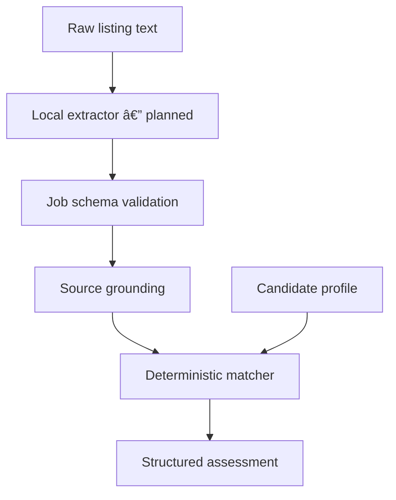

# MORI // LAMP Architecture

## Purpose

MORI // LAMP analyses job listings against evidence-backed candidate information and produces a reviewable, truthful assessment.

The system is designed to support applications. It does not invent candidate facts, decide whether to apply automatically, or submit applications.

## Current boundary

The current CLI starts with an already normalized job document and a candidate profile:

```powershell
mori-lamp match examples\job.normalized.json examples\profile.sample.json
```

Raw-text extraction is the next planned component. It does not exist yet.

## Target pipeline



Each stage has one responsibility and a defined failure boundary. A later stage must not silently repair invalid output from an earlier stage.

## Components

| Component | Responsibility |
|---|---|
| `models.py` | Defines strict `Job`, `Requirement`, `Responsibility`, `ApplicationRule`, `Profile`, and `Claim` schemas |
| `grounding.py` | Confirms extracted `source_text` exists in the supplied raw listing |
| `matching.py` | Performs deterministic, category-aware comparison of job requirements and candidate claims |
| `cli.py` | Handles arguments, file loading, JSON output, and process exit codes |
| Extractor interface | Will convert raw listing text into a candidate `Job` document without binding LAMP to one model runtime |

## Data contracts

### Job listing

A normalized job can contain:

- Source metadata
- Title and company
- Location and employment type
- Responsibilities
- Requirements
- Application rules

Requirements preserve semantic information including:

- Category
- Priority
- Description
- Original source text
- Evidence hints
- Minimum language level

Responsibilities and learning opportunities remain separate from entry requirements.

### Candidate profile

A profile contains categorized claims. Each claim can contain:

- Name
- Category
- Verification status
- Evidence
- Language level, when applicable

A claim marked as `verified` must contain evidence.

## Matching semantics

Claims and requirements match using both normalized name and category.

An identical name in the wrong category does not match. For example, a technical claim named `german` cannot satisfy a German-language requirement.

Language claims are additionally compared using CEFR order:

```text
A1 < A2 < B1 < B2 < C1 < C2
```

The matcher produces four outcome buckets:

| Outcome | Meaning |
|---|---|
| `verified_matches` | A verified claim satisfies the requirement |
| `needs_evidence` | A relevant self-reported claim exists |
| `unmet_requirements` | A claim exists but does not satisfy the requirement |
| `unknown_requirements` | No matching candidate claim exists |

## Grounding boundary

Extracted statements are not trusted merely because they satisfy the JSON schema.

Grounding checks verify that each responsibility, requirement, and application rule preserves source text found in the raw listing. Fabricated or unsupported source text causes validation to fail.

Grounding proves textual support. It does not by itself prove that the extractor interpreted the text correctly, so semantic fixture tests remain necessary.

## Trust boundaries

- Raw job listings are untrusted external input.
- Local model output is untrusted until schema and grounding validation succeed.
- Generated text never becomes a verified candidate fact.
- Self-reported claims are never silently promoted to verified claims.
- Personal candidate material remains outside Git under `data/private/`.
- LAMP never submits an application automatically.
- A human reviews every assessment and any future generated document.

## Error behaviour

The CLI uses process exit codes suitable for later automation:

- `0`: successful assessment
- `2`: invalid input, unreadable files, or rejected data

Pipeline failures should remain visible and machine-readable. Invalid extraction must not be converted into partial success without an explicit review state.

## Local extraction constraints

The planned extractor must satisfy these constraints:

1. No listing or candidate data leaves the laptop.
2. No usage-based fees are introduced.
3. Extraction quality is maximized within the available hardware.
4. The runtime and model remain replaceable behind a provider-independent interface.
5. Every result passes schema and grounding validation before matching.

The architectural decision is recorded in [ADR 0001](decisions/0001-local-first-extraction.md).

## Model-selection gate

Local runtimes and models will be compared using a repeatable evaluation harness rather than chosen from reputation alone.

The evaluation should measure:

- Schema-valid output rate
- Correct requirement and responsibility classification
- Preservation of priority and category semantics
- Grounded source-text coverage
- Fabricated or promoted requirement count
- Repeatability across runs
- Runtime, RAM, VRAM, and disk requirements

The existing ProSec fixture provides the first expected extraction target.

## Current status

Implemented:

- Strict schemas
- Evidence validation
- Category-aware matching
- CEFR comparison
- Source grounding
- CLI result and error behaviour
- Regression fixtures and tests

Planned next:

- Provider-independent extractor interface
- Extraction evaluation harness
- Local runtime and model benchmark
- End-to-end raw-listing command